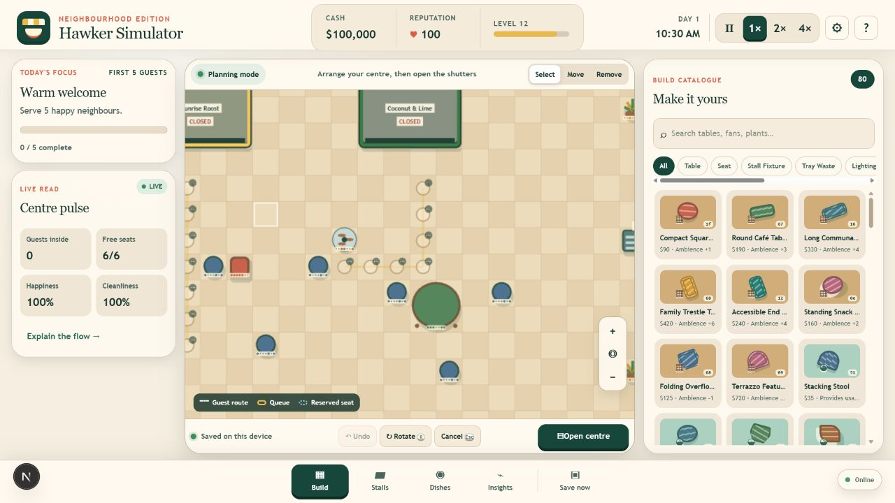
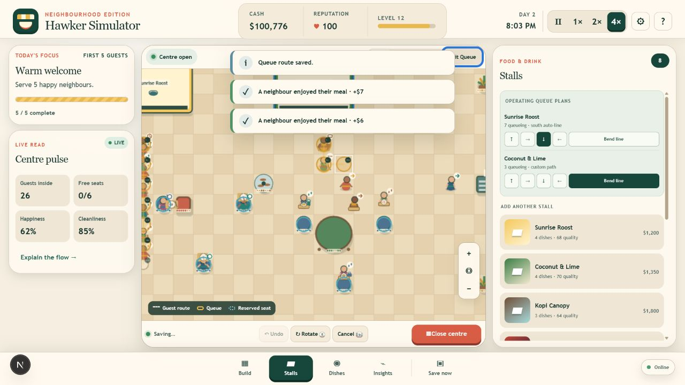

# Hawker Balance

Hawker Balance is a local-first desktop browser game about building and operating an original Singapore-inspired community dining hall while learning to compare nutrition trade-offs. Players arrange stalls and facilities, plan menus and reviewed recipe variants, then watch a deterministic customer simulation reveal service and nutrition decisions without labelling dishes good or bad.

The current release candidate is fully free and contains no accounts, advertising, analytics, payments, loot boxes, energy systems, or server-dependent mechanics.

## Key features

### Build and manage the hall

The main workspace combines a tile-based centre, live operational readouts, and a catalogue of visually distinct furniture and facilities.

### Watch a live service

Customers choose stalls, form separate queues, carry visible meals, find reserved seats, eat, return trays, and leave through the active exit.




### Manage each food stall

Every operating stall displays its queue count. Players can select a cardinal automatic route or draw a custom obstacle-safe line with bends. Players can also curate each menu, compare values for listed servings, and tune reviewed recipe variants while price and service timing remain stable.



### Guide guest movement

The Route editor lets players paint preferred walking lanes across clear floor tiles. Guests use the guides for every leg of a visit when practical, while obstacle-safe fallback routing keeps incomplete lanes from trapping them. Route guides are saved, undoable, and reserved from blocking furniture and stall queues.


## Launch content

- 12 original operational stalls
- 46 named dishes
- 28 reviewed base-dish nutrition profiles and 10 reviewed variant families
- 80 meaningfully distinct placeable catalogue items
- 12 customer archetypes
- 1 top-down neighbourhood-hall map theme
- 300 English localization entries

The validator counts catalogue entries by distinct gameplay definition, not by recolour. It checks links, IDs, assets, localization, collisions, rotations, unlocks, affordability, and behavioural uniqueness.

## Technology and direction

- TypeScript 5.9, React 19, Next 16, Vinext/Vite 8
- Phaser 4.2.1 for the world, camera, input, and rendering
- Pure deterministic TypeScript simulation core
- IndexedDB journal + backup saves through `idb`
- Versioned service worker and install manifest
- Vitest unit, integration, content, soak, and simulation-budget tests
- Orthographic top-down square grid
- Shape-led illustrated 2D rendered from code-native primitives

The UI remains semantic HTML around the game canvas so essential controls, settings, menus, status, focus, and text scaling remain accessible.

## Requirements

- Node.js 22.15 or newer
- npm 10 or newer
- A current desktop browser

## Run

```powershell
npm ci
npm run dev
```

Open `http://localhost:3000`.

Controls:

- Drag the map to pan; wheel or `+`/`-` to zoom.
- Arrow keys move and follow the keyboard build cursor.
- `Enter` places, selects, or toggles a preferred route tile; `R` rotates, `Esc` finishes/cancels, and `U` undoes.
- Choose **Route** to paint or erase preferred guest lanes with the pointer or keyboard cursor.
- `Space` pauses while the world has focus.
- The HTML controls expose build, stall, menu-planning, nutrition, insight, speed, save, and settings actions.

## Validate

```powershell
npm run typecheck
npm run lint
npm test
npm run validate:content
npm run build
npm run test:ssr
```

The single release gate runs the complete sequence:

```powershell
npm run test:release
```

The repeatable 80-agent benchmark is part of `npm test` and prints a `BENCHMARK_RESULT` JSON record. Browser FPS, memory, and offline restart claims must still be measured on described hardware; the Node benchmark is not a substitute for browser profiling.

## Production

```powershell
npm run dev          # development
npm run test:release # full release gate
npm run build        # Sites / Cloudflare Worker build
npm run build:vercel # native Next.js build for Vercel
npm run start        # serve the Sites production build
```

GitHub Actions verifies both production targets, publishes pull-request previews to Vercel, stages `main` as an immutable Production deployment, and waits for a protected approval before promotion. The Sites output is written to `dist/`; Vercel packages the native Next.js build separately. Both paths stamp the service worker with a deterministic content hash so code, content, and cached assets move together.

Before enabling deployments, follow every **User action** in the [deployment and rollback runbook](docs/DEPLOYMENT.md). Also review the [release checklist](docs/RELEASE_CHECKLIST.md) and [known issues](docs/KNOWN_ISSUES.md).

## Offline and saves

The first successful production load installs an application shell and warms every observed runtime chunk, including Phaser, through an acknowledged service-worker cache transaction. A waiting update is warmed and verified before the game offers “Save & update.” Player progress is stored separately in IndexedDB with versioning, checksums, serialized writes, an active slot, a backup slot, core migrations, and export/import tools.

Private browsing, denied storage, or quota failures can make persistence temporary. The game degrades to unsaved play and reports the limitation without collecting any personal information.

## Project documentation

Start with:

- [Project status](docs/PROJECT_STATUS.md)
- [Game design](docs/GAME_DESIGN_DOCUMENT.md)
- [Technical design](docs/TECHNICAL_DESIGN.md)
- [Art bible](docs/ART_BIBLE.md)
- [Content catalogue](docs/CONTENT_CATALOGUE.md)
- [Nutrition data and educational-use policy](docs/NUTRITION_DATA.md)
- [Cultural review checklist](docs/CULTURAL_REVIEW.md)
- [Accessibility](docs/ACCESSIBILITY.md)
- [Test plan and report](docs/TEST_PLAN.md)
- [Performance budget and report](docs/PERFORMANCE_BUDGET.md)
- [Security and privacy](docs/SECURITY_AND_PRIVACY.md)

## Release status

The expanded 12-stall / 46-dish source passes the automated release gate on bundled Node.js `v24.14.0`, including both Sites/Vinext and Vercel production builds. The project must not be described as production-approved until the current artifact record and exact Chrome/Edge/Firefox, offline restart/update, render performance, long-soak, accessibility, cultural, security, and qualified legal/privacy review evidence are complete. The Node benchmark does not measure the renderer's full-frame redraw and per-frame text recreation, and no human or external approval is implied by the internal checklists.

## License and provenance

All game identity, code-native visual assets, procedural audio cues, copy, and stall names are original project work. Generated nutrition content is a reviewed transformation of operator-supplied source snapshots; the raw datasets are not redistributed. Dependency notices are in [THIRD_PARTY_NOTICES.md](THIRD_PARTY_NOTICES.md); asset provenance is in [docs/ASSET_PROVENANCE.md](docs/ASSET_PROVENANCE.md).
